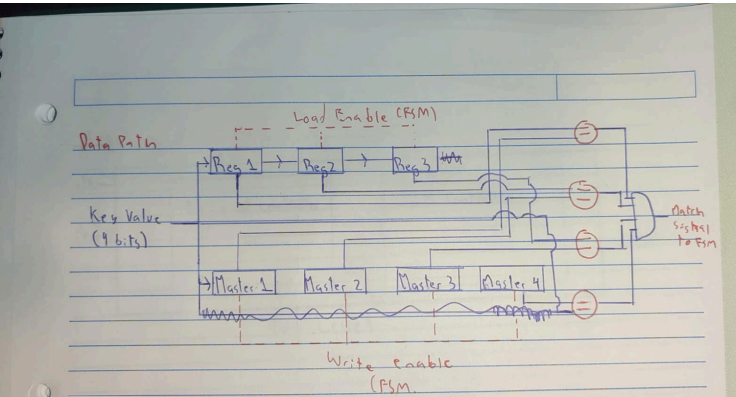
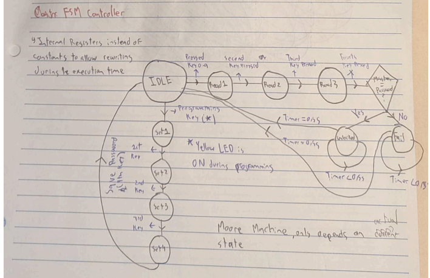
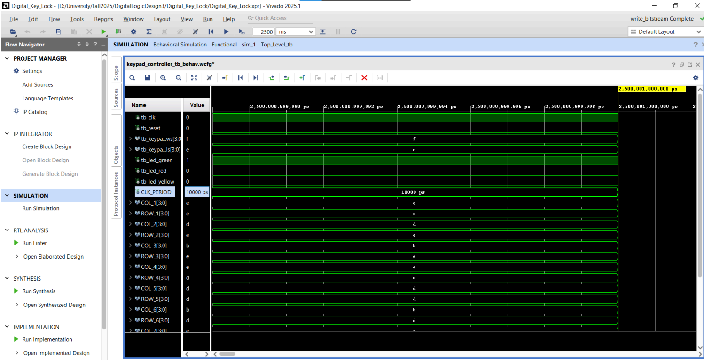

# FPGA Digital Access Control System

This repository contains the VHDL implementation of a configurable digital lock system designed for the Xilinx Artix-7 FPGA architecture. The project demonstrates Register Transfer Level (RTL) design, Finite State Machine (FSM) implementation, and synchronous logic verification.

The system features a runtime-programmable security code, allowing users to overwrite the default factory password stored in internal registers through a specific input sequence.

## Technical Specifications

* **Target Hardware:** Xilinx Artix-7 FPGA (Basys 3 Development Board)
* **Language:** VHDL (IEEE 1076 Standard)
* **Synthesis Tool:** Xilinx Vivado ML Standard
* **Input Interface:** 4x4 Matrix Keypad with custom 20ms debounce logic
* **Clock Frequency:** 100 MHz (System Clock)

## System Architecture

The design is modular, separating the hardware driver layer from the application logic.

### 1. Datapath and Configuration
The system uses a register-based datapath for password storage. Unlike hard-coded locks, the "Master Key" is stored in parallel registers that can be updated during operation. A 4-bit comparator verifies user input against the current register values in real-time.

*Figure 1: Datapath showing register logic and comparator flow.*

### 2. Finite State Machine (FSM)
Control logic is governed by a Moore Machine architecture to ensure output stability synchronous to the clock edge.

* **S_IDLE:** Default locked state.
* **S_READ:** Captures and shifts user input.
* **S_SET_KEY:** Programming mode for updating the password.
* **S_UNLOCKED:** Access granted state with a hardware timer.

*Figure 2: FSM State Transition Diagram.*

## Verification

The system was verified using a behavioral testbench (`Top_Level_tb`) covering 2500ms of simulation time. The test plan validated four critical scenarios:

1.  **Integrity Check:** Successful unlock using the default reset code (1-3-5-7).
2.  **Configuration Mode:** Entry into programming mode and writing a new code to registers.
3.  **Security Check:** Rejection of the old code after the update.
4.  **Validation:** Successful unlock using the new user-defined code.

*Figure 3: Behavioral simulation waveforms confirming state transitions.*

## Repository Structure

* `src/`: Synthesizable VHDL source code (Top Level, FSM, Keypad Driver).
* `sim/`: Testbench files for behavioral simulation.
* `constraints/`: XDC constraints file for pin mapping.
* `bitstream/`: Generated .bit file for device programming.
* `docs/`: Architecture diagrams and schematics.
* `Project_Documentation.pdf`: Full engineering report.
